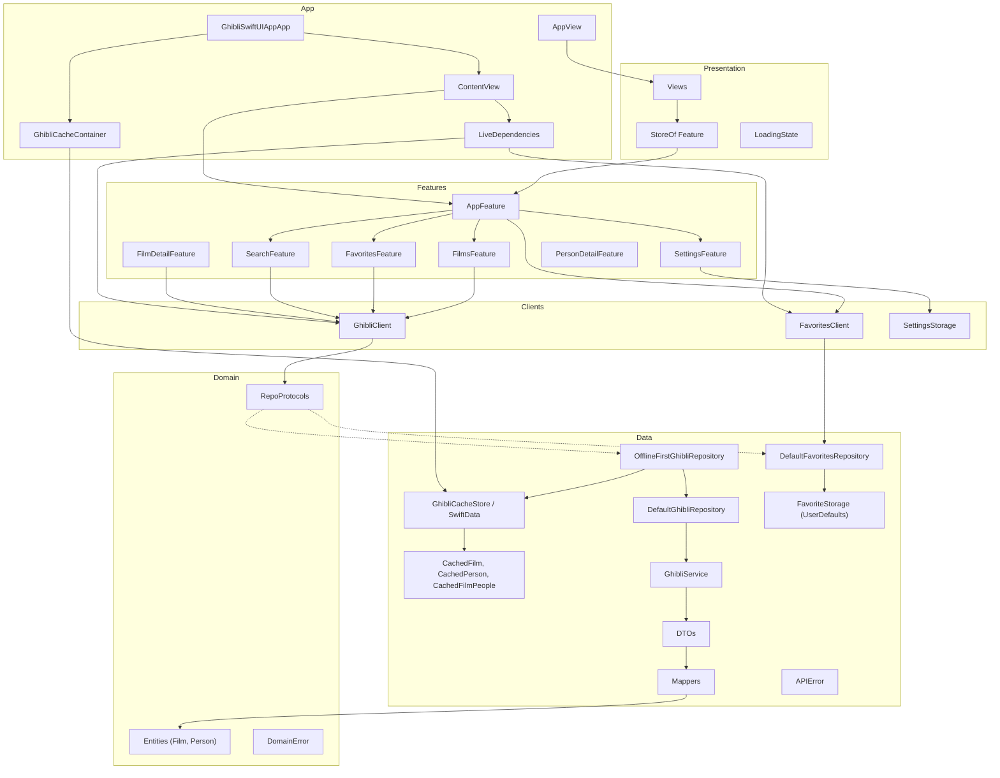
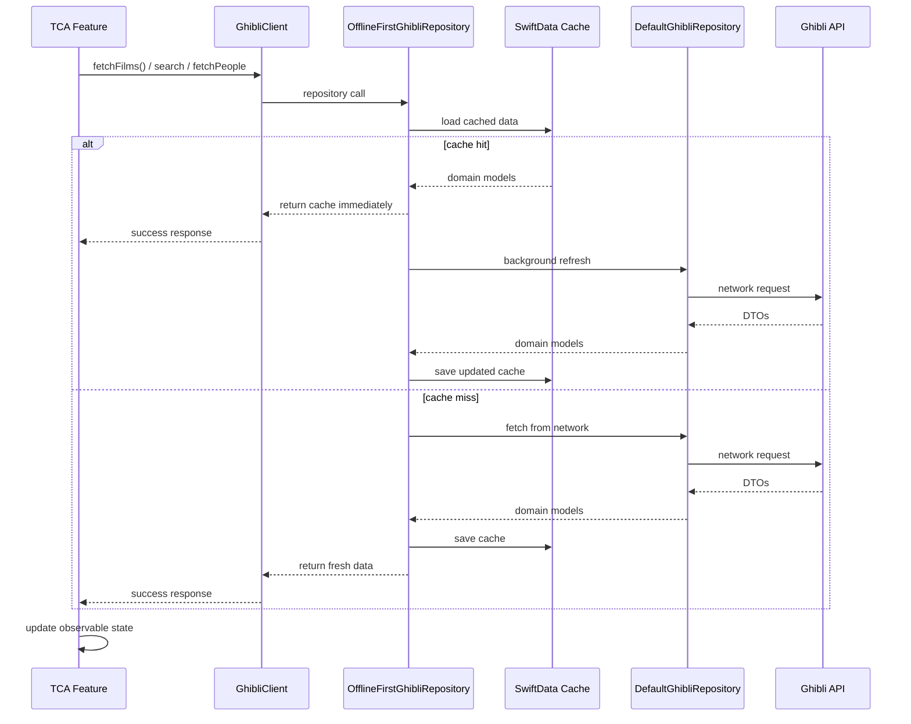
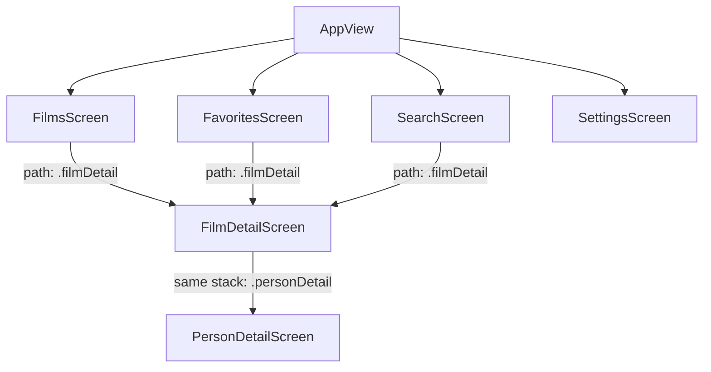
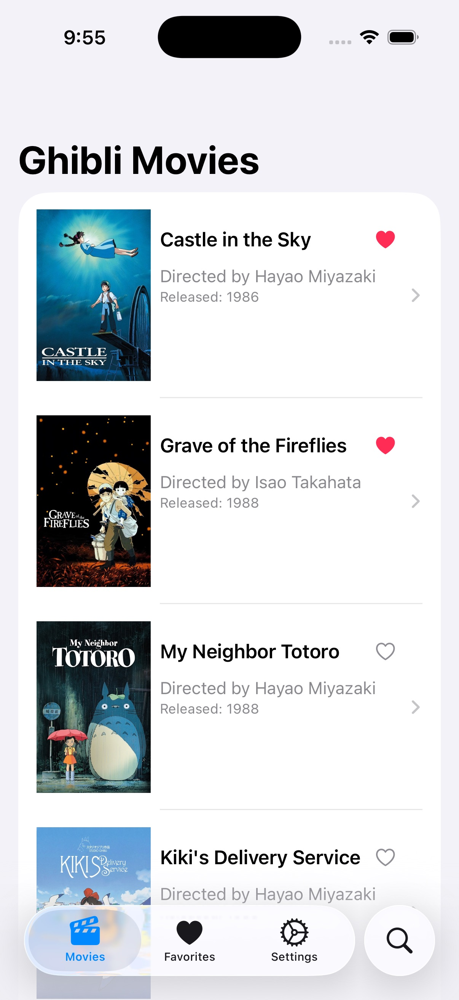

# GhibliSwiftUIApp

A SwiftUI reference app for the [Studio Ghibli API](https://ghibliapi.vercel.app/), built with **Clean Architecture + TCA (The Composable Architecture)**, constructor-injected clients, and **offline-first** caching via **SwiftData**.

## Tech Stack

- iOS 17+
- SwiftUI with TCA `@ObservableState` and `@Bindable` stores
- [swift-composable-architecture](https://github.com/pointfreeco/swift-composable-architecture) 1.25+
- URLSession with async/await
- **SwiftData** for offline-first local caching (films catalog + film people)
- Clean Architecture (Domain, Data, Features, Presentation, App) + TCA
- **TCA `StackState` navigation** with SwiftUI `NavigationStack` path bindings
- Swift Testing with `TestStore`, mocks, and constructor injection

## API

- Base URL: `https://ghibliapi.vercel.app/`
- Endpoints used: `/films`, `/people`
- No authentication required

## Architecture

The app is organized into logical layers inside the `GhibliSwiftUIApp` target. **Features** (TCA reducers) talk to **clients** (`GhibliClient`, `FavoritesClient`). **Clients** call **repository protocols**. **Repository implementations** coordinate **network services**, **SwiftData cache**, and **local storage** (UserDefaults for favorites and settings).



### Layer responsibilities

| Layer | Location | Responsibility |
|-------|----------|----------------|
| **App** | `App/` | Composition root (`LiveDependencies`, `GhibliCacheContainer`), `ContentView`, `AppView`, app entry, `.modelContainer` |
| **Features** | `Features/` | TCA reducers (`AppFeature`, tab features, detail features), `StackState` navigation via `.forEach(\.path, action: \.path)` |
| **Clients** | `Clients/` | `GhibliClient`, `FavoritesClient`, `LiveDependencies`, `SettingsStorage` — boundary between features and data |
| **Presentation** | `Presentation/` | SwiftUI views bound to `StoreOf<Feature>`, `LoadingState` |
| **Domain** | `Domain/` | Pure Swift entities, repository **protocols**, `DomainError` |
| **Data** | `Data/` | Repository implementations, SwiftData cache, network/local services, DTOs, mappers, `APIError` |

**Dependency rule:** Features, Presentation, and Data depend on Domain. Domain does not import Presentation, Features, or Data.

### Composition root (`LiveDependencies`)

`LiveDependencies` is the **only** place that wires concrete types into clients:

| Production (`live`) | Preview (`preview`) |
|---------------------|---------------------|
| `GhibliCacheContainer` + SwiftData | `NullGhibliCacheStore` (no disk cache) |
| `OfflineFirstGhibliRepository` → `DefaultGhibliRepository` + cache | Same stack with `MockGhibliService` |
| `DefaultFavoriteStorage` | `MockFavoriteStorage` |

`ContentView` calls `LiveDependencies.make(...)`, injects `ghibliClient` and `favoritesClient` into `AppFeature` when creating the root `Store<AppFeature>`, and passes that store to `AppView`.

### Offline-first data flow



**Policies:**

1. **Read** — return SwiftData cache when available (stale-while-revalidate).
2. **Refresh** — when cache exists, update from the API in a background `Task`.
3. **Fallback** — on network errors, return cache when possible instead of failing the screen.
4. **Search offline** — filter cached films locally when the catalog is already stored.

Favorites use **UserDefaults** via `FavoritesClient` / `FavoriteStorage` (not SwiftData). Settings use **UserDefaults** via `SettingsStorage`.

**Character loading note:** some films (e.g. *Arrietty*) return placeholder people URLs like `.../people/` instead of `.../people/{id}`. `DefaultGhibliRepository` filters those invalid collection URLs, skips per-person decode failures, and returns an empty list instead of surfacing a screen error.

### Navigation (TCA + SwiftUI)

Navigation is **reducer-driven** using TCA `StackState` and `.forEach(\.path, action: \.path)`. Each tab feature owns its navigation stack; child reducers compose into the path.



**Flows:**

1. **Film list → detail** — user taps a film in `FilmListView` → tab feature receives `.filmTapped(film)` → reducer appends `FilmDetailFeature.State` to `path` → `NavigationStack` presents `FilmDetailScreen` with a scoped store.
2. **Film detail → person detail** — user taps a character → `FilmDetailFeature` receives `.personTapped(person)` → parent tab feature appends `.personDetail(...)` to the **same** navigation stack (no nested `NavigationStack`).

**Responsibilities:**

1. **`AppFeature`** — owns shared `favoriteIDs`, coordinates tab child features, loads favorites on appear, persists favorite toggles.
2. **`AppView`** — owns the `TabView` and scopes child stores (`films`, `favorites`, `search`, `settings`).
3. **`FilmTabNavigation.Path`** — shared `@Reducer` enum (`.filmDetail`, `.personDetail`) composed into each tab's `StackState`.
4. **Tab features** — own `path: StackState<FilmTabNavigation.State>()` and compose `FilmTabNavigation(ghibliClient:)` via `.forEach(\.path, action: \.path)`.
5. **Views** — one `NavigationStack` per tab, bound with `$store.scope(state: \.path, action: \.path)`; destinations use `switch store.case`.

#### Adding a new screen to the tab navigation stack

All tab screens share a single path type (`FilmTabNavigation.Path`). To add a new destination, extend that shared type — no new `StackState` or extra `NavigationStack` is needed.

| Step | Action | Example |
|------|--------|---------|
| 1 | Add a case to `FilmTabNavigation.Path` | `case newScreen(NewFeature)` |
| 2 | Create the feature + view | `NewFeature.swift`, `NewScreen.swift` |
| 3 | Wire the child reducer in `FilmTabNavigation.body` | `.ifCaseLet(/State.newScreen, action: /Action.newScreen) { NewFeature() }` |
| 4 | Handle the trigger action in the tab feature's reducer | `case .somethingTapped: state.path.append(.newScreen(NewFeature.State(...))); return .none` |
| 5 | Render the destination in `FilmTabPathDestinationView` | Add `case let .newScreen(store):` to the `switch store.case` block |

**Why `StackState` in the reducer?**

- Navigation stack is part of app state — push/pop is testable with `TestStore`.
- Child features stay composable via `.forEach` instead of ephemeral stores created in view modifiers.
- SwiftUI stays in sync through `$store.scope(state: \.path, action: \.path)`.

## Project Structure

```
GhibliSwiftUIApp/
├── App/
│   ├── GhibliSwiftUIAppApp.swift      # ModelContainer + ContentView
│   ├── ContentView.swift              # root Store<AppFeature>
│   └── DI/
│       └── GhibliCacheContainer.swift
├── Clients/
│   ├── GhibliClient.swift             # fetchFilms, searchFilms, fetchPeople
│   ├── FavoritesClient.swift          # load/save favorite IDs
│   ├── LiveDependencies.swift         # live() / preview() wiring
│   └── SettingsStorage.swift          # UserDefaults persistence for settings
├── Features/
│   ├── App/                           AppFeature, AppView
│   ├── Films/                         FilmsFeature
│   ├── Favorites/                     FavoritesFeature
│   ├── Search/                        SearchFeature
│   ├── Settings/                      SettingsFeature
│   ├── FilmDetail/                    FilmDetailFeature
│   ├── PersonDetail/                  PersonDetailFeature
│   └── Shared/                        FilmTabNavigation (@Reducer enum Path shared across tabs)
├── Domain/
│   ├── Entities/                      Film, Person
│   ├── Errors/                        DomainError
│   └── Repositories/                  GhibliRepository, FavoritesRepository (protocols)
├── Data/
│   ├── DTOs/                          FilmDTO, PersonDTO
│   ├── Mappers/                       FilmMapper, PersonMapper, CacheEntityMapper, APIError+DomainError
│   ├── Network/                       GhibliService, Default/MockGhibliService
│   ├── Local/                         FavoriteStorage, Default/MockFavoriteStorage
│   ├── SwiftData/
│   │   ├── Models/                    CachedFilm, CachedPerson, CachedFilmPeople
│   │   ├── GhibliCacheStore.swift     # protocol + NullGhibliCacheStore
│   │   ├── GhibliSwiftDataStack.swift
│   │   ├── SwiftDataGhibliCacheStore.swift
│   │   └── SwiftDataGhibliCacheStoreBridge.swift
│   └── Repositories/
│       ├── DefaultGhibliRepository.swift      # network-only
│       ├── OfflineFirstGhibliRepository.swift # cache + network
│       └── DefaultFavoritesRepository.swift
├── Presentation/
│   ├── Common/                        LoadingState
│   ├── Films/
│   │   ├── FilmsScreen/Views/         FilmsScreen
│   │   ├── FilmDetail/Views/          FilmDetailScreen
│   │   ├── FilmList/Views/            FilmListView
│   │   ├── PersonDetail/Views/        PersonDetailScreen
│   │   └── Shared/Views/              FavoriteButton, FilmImageView
│   ├── Search/
│   ├── Favorites/
│   ├── Settings/
│   └── Shared/                        FilmTabPathDestinationView (shared NavigationStack destination)
├── PreviewSupport/
├── Preview Assets/
└── Assets.xcassets/

GhibliSwiftUIAppTests/
├── Features/                          App, Films, Favorites, Search, FilmDetail, Settings
├── Repositories/                      DefaultGhibli, OfflineFirst, DefaultFavorites
├── Services/                          DefaultGhibliService
├── Mocks/                             MockClients, services, repos, cache, storage, URLProtocol
└── Support/                           TestFixtures, NetworkTestFixtures
```

## Features

- TabView with per-tab TCA stores scoped from `AppFeature`
- **Movies** — offline-first film list (cache first, background refresh, network fallback); paginated via `itemsPerPage` from Settings
- **Detail** — film info, async image loading, cached characters with network refresh; tap a character to open person detail
- **Person detail** — character profile screen pushed by the parent tab feature intercepting `.personTapped` and appending `.personDetail` to its `StackState<FilmTabNavigation.State>`; `FilmDetailFeature` itself has no nested stack
- **Favorites** — filtered list with loading/error states; local persistence via UserDefaults
- **Search** — client-side filter with 500ms debounce (works offline when films are cached)
- **Settings** — appearance theme and preferences stored in UserDefaults via `SettingsFeature`

<p float="left">
  
  
  
</p>

<p float="left">
  
  
  
</p>

## Testing

Unit tests live in `GhibliSwiftUIAppTests/` and are split **by layer**, each mocking only its direct dependency:

| Layer | Test location | Mock boundary |
|-------|---------------|---------------|
| **Features** | `Features/` | `MockClients` via constructor injection into reducers (`TestStore`) |
| **Repositories** | `Repositories/` | Services, cache store, storage, remote repository |
| **Services** | `Services/` | `URLSession` via `MockURLProtocol` |

Shared fixtures live in `Support/TestFixtures.swift` and `Support/NetworkTestFixtures.swift`.

**Run tests:** `Cmd+U` in Xcode, or:

```bash
xcodebuild test -scheme GhibliSwiftUIApp \
  -destination 'platform=iOS Simulator,name=iPhone 17' \
  -skipMacroValidation -skipPackagePluginValidation
```

`DefaultGhibliServiceTests` uses `@Suite(.serialized)` because the `URLProtocol` handler is shared static state.
