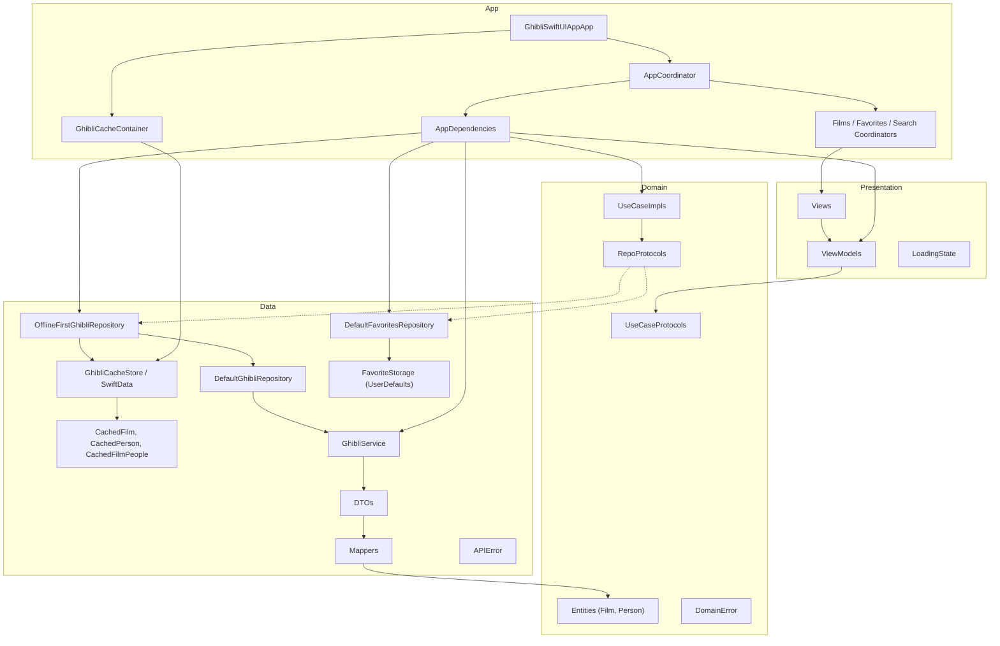
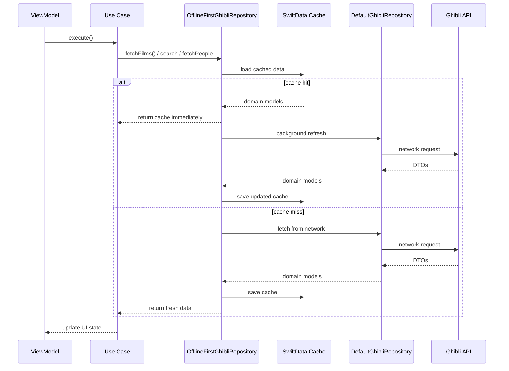
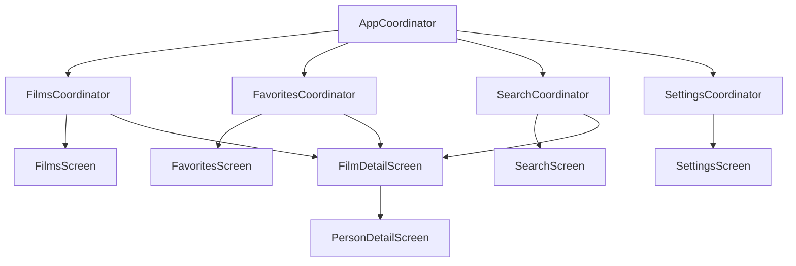

# GhibliSwiftUIApp

A SwiftUI reference app for the [Studio Ghibli API](https://ghibliapi.vercel.app/), built with **Clean Architecture + MVVM**, manual dependency injection, and **offline-first** caching via **SwiftData**.

## Tech Stack

- iOS 17+
- SwiftUI with `@Observable` (Observation framework)
- URLSession with async/await
- **SwiftData** for offline-first local caching (films catalog + film people)
- Clean Architecture (Domain, Data, Presentation, App) + MVVM
- **Coordinator pattern** for tab and navigation flow
- Swift Testing with mocks and dependency injection

## API

- Base URL: `https://ghibliapi.vercel.app/`
- Endpoints used: `/films`, `/people`
- No authentication required

## Architecture

The app is organized into four **logical layers** inside the `GhibliSwiftUIApp` target. **ViewModels** talk only to **use case protocols**. **Use case implementations** talk only to **repository protocols**. **Repository implementations** coordinate **network services**, **SwiftData cache**, and **local storage** (UserDefaults for favorites).



### Layer responsibilities

| Layer | Location | Responsibility |
|-------|----------|----------------|
| **App** | `App/` | Composition root (`AppDependencies`, `GhibliCacheContainer`), coordinators, `ContentView`, app entry, `.modelContainer` |
| **Presentation** | `Presentation/` | SwiftUI views, `@Observable` view models, `LoadingState` |
| **Domain** | `Domain/` | Pure Swift entities, use case + repository **protocols**, default use cases, `DomainError` |
| **Data** | `Data/` | Repository implementations, SwiftData cache, network/local services, DTOs, mappers, `APIError` |

**Dependency rule:** Presentation and Data depend on Domain. Domain does not import Presentation or Data.

### Composition root (`AppDependencies`)

`AppDependencies` is the **only** place that wires concrete types:

| Production (`live`) | Preview (`preview`) |
|---------------------|---------------------|
| `GhibliCacheContainer` + SwiftData | `NullGhibliCacheStore` (no disk cache) |
| `OfflineFirstGhibliRepository` → `DefaultGhibliRepository` + cache | Same stack with `MockGhibliService` |
| `DefaultFavoriteStorage` | `MockFavoriteStorage` |

### Offline-first data flow



**Policies:**

1. **Read** — return SwiftData cache when available (stale-while-revalidate).
2. **Refresh** — when cache exists, update from the API in a background `Task`.
3. **Fallback** — on network errors, return cache when possible instead of failing the screen.
4. **Search offline** — filter cached films locally when the catalog is already stored.

Favorites use **UserDefaults** via `FavoriteStorage` (not SwiftData).

**Character loading note:** some films (e.g. *Arrietty*) return placeholder people URLs like `.../people/` instead of `.../people/{id}`. `DefaultGhibliRepository` filters those invalid collection URLs, skips per-person decode failures, and returns an empty list instead of surfacing a screen error.

### Navigation (Coordinator)

Navigation is handled by **coordinators** in `App/Coordinator/`. Views render UI; coordinators own `NavigationStack`, `NavigationPath`, and push destinations.



**Flows:**

1. **Film list → detail** — user taps a film in `FilmListView` → `FilmCoordinatorRoute.detail(film)` is pushed → `CoordinatorNavigationStack` presents `FilmDetailScreen`.
2. **Film detail → person detail** — user taps a character → `FilmCoordinatorRoute.personDetail(person)` is pushed → `CoordinatorNavigationStack` presents `PersonDetailScreen`.

**Responsibilities:**

1. **`AppCoordinator`** — owns the `TabView`, creates child coordinators, runs startup tasks (load favorites, fetch films).
2. **`FilmsCoordinator` / `FavoritesCoordinator` / `SearchCoordinator`** — each owns a `NavigationPath`, wraps its root screen, and builds pushed destinations.
3. **`FilmCoordinatorRoute`** — shared route enum (`.detail(Film)`, `.personDetail(Person)`).
4. **`CoordinatorNavigationStack`** — binds `NavigationStack(path:)` and maps each route case to a screen.
5. **Views** — no longer own `NavigationStack`; they push routes and focus on layout/state.

#### Adding a new screen

| Step | Action | Example |
|------|--------|---------|
| 1 | Add a route case | `case personDetail(Person)` in `FilmCoordinatorRoute` |
| 2 | Create the view (UI only) | `PersonDetailScreen.swift` |
| 3a | Map route → screen | `case .personDetail(let person):` in `CoordinatorNavigationStack` |
| 3b | Add screen factory (required) | `personDetailScreen(for:)` in `FilmNavigationCoordinating` |
| 3c | Add `show*` helper (optional) | `showPersonDetail(_:)` for programmatic navigation |
| 4 | Trigger navigation | `NavigationLink(value:)` or `showPersonDetail(_:)` |

**Why two coordinator methods per screen?**

- `showPersonDetail(_:)` — **navigates** by appending a route to `path` (for buttons/tasks).
- `personDetailScreen(for:)` — **builds** the destination view when the route is active (used by `navigationDestination`).

If you only use `NavigationLink(value:)`, the `show*` helper is optional.

## Project Structure

```
GhibliSwiftUIApp/
├── App/
│   ├── GhibliSwiftUIAppApp.swift      # ModelContainer + AppDependencies
│   ├── ContentView.swift              # hosts AppCoordinator.rootView
│   ├── Coordinator/
│   │   ├── AppCoordinator.swift       # TabView + startup tasks
│   │   ├── FilmsCoordinator.swift
│   │   ├── FavoritesCoordinator.swift
│   │   ├── SearchCoordinator.swift
│   │   ├── SettingsCoordinator.swift
│   │   ├── FilmCoordinatorRoute.swift
│   │   ├── FilmNavigationCoordinating.swift
│   │   └── CoordinatorNavigationStack.swift
│   └── DI/
│       ├── AppDependencies.swift      # live() / preview() wiring
│       └── GhibliCacheContainer.swift
├── Domain/
│   ├── Entities/                      Film, Person
│   ├── Errors/                        DomainError
│   ├── Repositories/                  GhibliRepository, FavoritesRepository (protocols)
│   └── UseCases/                      FetchFilms, SearchFilms, FetchFilmPeople, ManageFavorites
├── Data/
│   ├── DTOs/                          FilmDTO, PersonDTO
│   ├── Mappers/                       FilmMapper, PersonMapper, CacheEntityMapper, APIError+DomainError
│   ├── Network/                       GhibliService, Default/MockGhibliService
│   ├── Local/                         FavoriteStorage, Default/MockFavoriteStorage
│   ├── SwiftData/
│   │   ├── Models/                    CachedFilm, CachedPerson, CachedFilmPeople
│   │   ├── GhibliCacheStore.swift     # protocol + NullGhibliCacheStore
│   │   ├── GhibliSwiftDataStack.swift
│   │   ├── SwiftDataGhibliCacheStore.swift
│   │   └── SwiftDataGhibliCacheStoreBridge.swift
│   └── Repositories/
│       ├── DefaultGhibliRepository.swift      # network-only
│       ├── OfflineFirstGhibliRepository.swift # cache + network
│       └── DefaultFavoritesRepository.swift
├── Presentation/
│   ├── Common/                        LoadingState
│   ├── Films/                         ViewModels + Views (Films, FilmDetail, PersonDetail, FilmList)
│   ├── Search/
│   ├── Favorites/
│   └── Settings/
├── PreviewSupport/
├── Preview Assets/
└── Assets.xcassets/

GhibliSwiftUIAppTests/
├── ViewModels/                        SearchFilms, Films, FilmDetail, Favorites
├── Repositories/                      DefaultGhibli, OfflineFirst, DefaultFavorites
├── Services/                          DefaultGhibliService
├── Mocks/                             Use cases, services, repos, cache, storage, URLProtocol
└── Support/                           TestFixtures, NetworkTestFixtures
```

## Features

- TabView with per-tab coordinators owning navigation stacks
- **Movies** — offline-first film list (cache first, background refresh, network fallback)
- **Detail** — film info, async image loading, cached characters with network refresh; tap a character to open person detail
- **Person detail** — character profile screen pushed via coordinator routes
- **Favorites** — local persistence via UserDefaults
- **Search** — client-side filter with 500ms debounce (works offline when films are cached)
- **Settings** — appearance theme and preferences stored in UserDefaults

<p float="left">
  
  
  
</p>

<p float="left">
  
  
  
</p>

## Testing

Unit tests live in `GhibliSwiftUIAppTests/` and are split **by layer**, each mocking only its direct dependency:

| Layer | Test location | Mock boundary |
|-------|---------------|---------------|
| **ViewModels** | `ViewModels/` | Use case protocols (`MockSearchFilmsUseCase`, etc.) |
| **Repositories** | `Repositories/` | Services, cache store, storage, remote repository |
| **Services** | `Services/` | `URLSession` via `MockURLProtocol` |

Shared fixtures live in `Support/TestFixtures.swift` and `Support/NetworkTestFixtures.swift`.

**Run tests:** `Cmd+U` in Xcode, or:

```bash
xcodebuild test -scheme GhibliSwiftUIApp -destination 'platform=iOS Simulator,name=iPhone 17'
```

`DefaultGhibliServiceTests` uses `@Suite(.serialized)` because the `URLProtocol` handler is shared static state.
