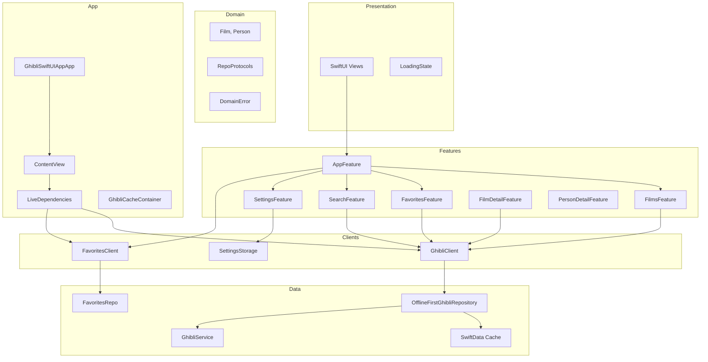

# GhibliSwiftUIApp

A SwiftUI reference app for the [Studio Ghibli API](https://ghibliapi.vercel.app/), built with **The Composable Architecture (TCA)**, constructor-injected clients, and **offline-first** caching via **SwiftData**.

## Tech Stack

- iOS 17+
- SwiftUI with TCA `@ObservableState` and `@Bindable` stores
- [swift-composable-architecture](https://github.com/pointfreeco/swift-composable-architecture) 1.25+
- URLSession with async/await
- **SwiftData** for offline-first local caching (films catalog + film people)
- Clean Architecture (Domain, Data, Features, Presentation, App)
- Swift Testing with `TestStore` and mock clients

## API

- Base URL: `https://ghibliapi.vercel.app/`
- Endpoints used: `/films`, `/people`
- No authentication required

## Architecture

The app uses **TCA** for state management and side effects. **Clients** replace the former use-case layer. **Repositories** and **services** in the Data layer are unchanged.



### Layer responsibilities

| Layer | Location | Responsibility |
|-------|----------|----------------|
| **App** | `App/` | Entry point, `ContentView`, `GhibliCacheContainer`, `.modelContainer` |
| **Features** | `Features/` | TCA reducers (`AppFeature`, tab features, detail features) |
| **Clients** | `Clients/` | `GhibliClient`, `FavoritesClient`, `LiveDependencies`, `SettingsStorage` |
| **Presentation** | `Presentation/` | SwiftUI views bound to `StoreOf<Feature>` |
| **Domain** | `Domain/` | Entities, repository protocols, `DomainError` |
| **Data** | `Data/` | Repository implementations, SwiftData cache, network/local services |

**Dependency rule:** Features and Data depend on Domain. Domain does not import Presentation or TCA.

### Composition root

`LiveDependencies.make(cacheContainer:)` wires repositories into clients:

| Production | Preview |
|------------|---------|
| `GhibliCacheContainer` + SwiftData | `NullGhibliCacheStore` |
| `OfflineFirstGhibliRepository` | Same stack with `MockGhibliService` |
| `DefaultFavoriteStorage` | `MockFavoriteStorage` |

`ContentView` creates the root `Store<AppFeature>` and passes `ghibliClient` to `AppView` for navigation destinations.

### Navigation

Each tab owns a `NavigationStack`. Shared routes are defined in `FilmNavigationRoute`:

- `.filmDetail(Film)` — pushed from film lists via `FilmListView`
- `.personDetail(Person)` — pushed from `FilmDetailScreen` character links

`filmNavigationDestinations(ghibliClient:favoriteIDs:onFavoriteTapped:)` maps routes to detail screens. Favorite state is read from the parent tab store so the heart icon stays in sync.

### Offline-first data flow

1. **Read** — return SwiftData cache when available (stale-while-revalidate).
2. **Refresh** — when cache exists, update from the API in a background `Task`.
3. **Fallback** — on network errors, return cache when possible.
4. **Search offline** — filter cached films locally when the catalog is stored.

Favorites use **UserDefaults** via `FavoritesClient`. Settings use **UserDefaults** via `SettingsStorage`.

## Project Structure

```
GhibliSwiftUIApp/
├── App/
│   ├── GhibliSwiftUIAppApp.swift
│   ├── ContentView.swift
│   └── DI/
│       └── GhibliCacheContainer.swift
├── Clients/
│   ├── GhibliClient.swift
│   ├── FavoritesClient.swift
│   ├── LiveDependencies.swift
│   └── SettingsStorage.swift
├── Features/
│   ├── App/                    AppFeature, AppView
│   ├── Films/                  FilmsFeature
│   ├── Favorites/              FavoritesFeature
│   ├── Search/                 SearchFeature
│   ├── Settings/               SettingsFeature
│   ├── FilmDetail/             FilmDetailFeature
│   ├── PersonDetail/           PersonDetailFeature
│   └── Shared/                 FilmNavigationDestination
├── Domain/
│   ├── Entities/
│   ├── Errors/
│   └── Repositories/
├── Data/
│   ├── DTOs/, Mappers/, Network/, Local/, SwiftData/, Repositories/
├── Presentation/
│   ├── Films/, Favorites/, Search/, Settings/, Common/
├── PreviewSupport/
└── Assets.xcassets/

GhibliSwiftUIAppTests/
├── Features/                   TCA reducer tests (TestStore)
├── Repositories/
├── Services/
├── Mocks/                        MockClients, MockRepositories, etc.
└── Support/                      TestFixtures
```

## Features

- TabView with TCA-scoped child stores per tab
- **Movies** — offline-first film list with paginated display (`itemsPerPage` from Settings)
- **Detail** — film info, characters, live favorite toggle
- **Person detail** — character profile via `FilmNavigationRoute.personDetail`
- **Favorites** — filtered list with loading/error states
- **Search** — debounced search (500ms) with offline cache support
- **Settings** — appearance theme, username, items per page, notifications (TCA + UserDefaults)

## Testing

Unit tests use **Swift Testing** and TCA **`TestStore`**:

| Layer | Location | Approach |
|-------|----------|----------|
| **Features** | `Features/` | `TestStore` + `MockClients` constructor injection |
| **Repositories** | `Repositories/` | Mock services, cache, storage |
| **Services** | `Services/` | `URLSession` via `MockURLProtocol` |

```bash
xcodebuild test -scheme GhibliSwiftUIApp \
  -destination 'platform=iOS Simulator,name=iPhone 17' \
  -skipMacroValidation -skipPackagePluginValidation
```

`DefaultGhibliServiceTests` uses `@Suite(.serialized)` because the `URLProtocol` handler is shared static state.
