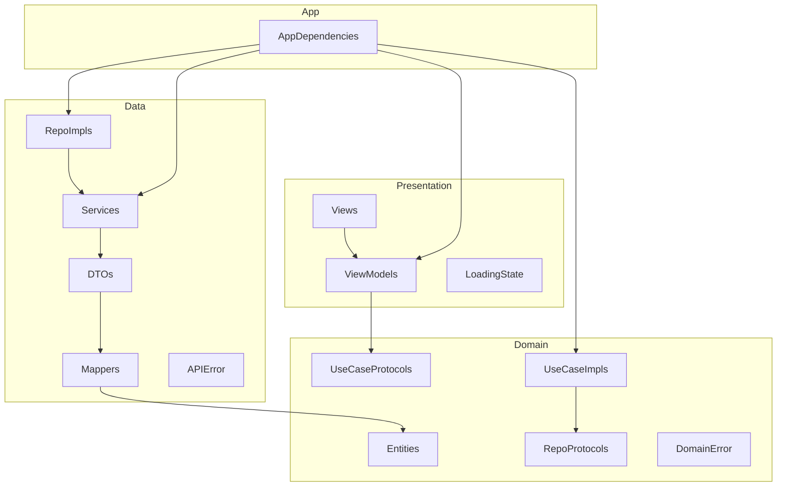

# GhibliSwiftUIApp

A SwiftUI reference app for the [Studio Ghibli API](https://ghibliapi.vercel.app/), built with **Clean Architecture + MVVM** and a local **GhibliKit** Swift package.

## Tech Stack

- iOS 17+
- SwiftUI with `@Observable` (Observation framework)
- URLSession with async/await
- Clean Architecture (Domain, Data, Presentation) + MVVM
- Local Swift Package (`GhibliKit`) for compile-time layer boundaries
- Swift Testing with mocks and dependency injection

## API

- Base URL: `https://ghibliapi.vercel.app/`
- Endpoints used: `/films`, `/people`
- No authentication required

## Architecture

The app is split into four layers. **ViewModels** talk only to **Use Case protocols**. **Use Case implementations** talk only to **Repository protocols**. **Repository implementations** talk to **Services**, which decode **DTOs** and map them to **Domain entities** before data crosses into the Domain layer.



### Layer responsibilities

| Layer | Module | Responsibility |
|-------|--------|----------------|
| **App** | `GhibliSwiftUIApp` | Composition root (`AppDependencies`), entry point, assets, previews |
| **Presentation** | `GhibliPresentation` | SwiftUI views, `@Observable` view models, `LoadingState` |
| **Domain** | `GhibliDomain` | Pure Swift entities, use cases, repository protocols, `DomainError` |
| **Data** | `GhibliData` | Repository implementations, network/local services, DTOs, mappers, `APIError` |

### Module dependencies

```
GhibliSwiftUIApp  →  GhibliPresentation, GhibliData, GhibliDomain
GhibliPresentation  →  GhibliDomain
GhibliData  →  GhibliDomain
GhibliDomain  →  (no dependencies)
```

`AppDependencies` is the **only** place that wires concrete types (`DefaultGhibliService`, `DefaultGhibliRepository`, `DefaultFetchFilmsUseCase`, etc.).

## Project Structure

```
GhibliSwiftUIApp/                    # App target
├── App/
│   ├── GhibliSwiftUIAppApp.swift
│   ├── ContentView.swift
│   └── DI/AppDependencies.swift
├── PreviewSupport/
├── Preview Assets/
└── Assets.xcassets/

Packages/GhibliKit/                  # Local Swift package
├── Package.swift
└── Sources/
    ├── GhibliDomain/
    │   ├── Entities/                Film, Person
    │   ├── Errors/                  DomainError
    │   ├── Repositories/            GhibliRepository, FavoritesRepository
    │   └── UseCases/                FetchFilms, SearchFilms, FetchFilmPeople, ManageFavorites
    ├── GhibliData/
    │   ├── DTOs/                    FilmDTO, PersonDTO
    │   ├── Mappers/                 FilmMapper, PersonMapper, APIError+DomainError
    │   ├── Network/                 GhibliService, DefaultGhibliService, MockGhibliService
    │   ├── Local/                   FavoriteStorage, Default/MockFavoriteStorage
    │   ├── Repositories/            DefaultGhibliRepository, DefaultFavoritesRepository
    │   └── Resources/               SampleData.json
    └── GhibliPresentation/
        ├── Common/                  LoadingState
        ├── Films/                   ViewModels + Views
        ├── Search/
        ├── Favorites/
        └── Settings/
```

## Features

- TabView with Navigation Stacks
- **Movies** — fetch films from the API and display a list
- **Detail** — film info, async image loading, parallel character fetch
- **Favorites** — local persistence via UserDefaults
- **Search** — client-side filter with 500ms debounce
- **Settings** — appearance theme and preferences stored in UserDefaults

<p float="left">
  
  
</p>

<p float="left">
  
  
</p>


## Testing

Unit tests cover `SearchFilmsViewModel` debounce, cancellation, and error handling. Tests inject a mock `GhibliService` through `DefaultGhibliRepository` → `DefaultSearchFilmsUseCase`, mirroring the production wiring in `AppDependencies`.
