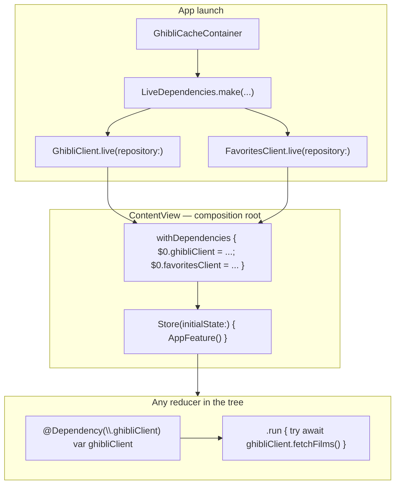
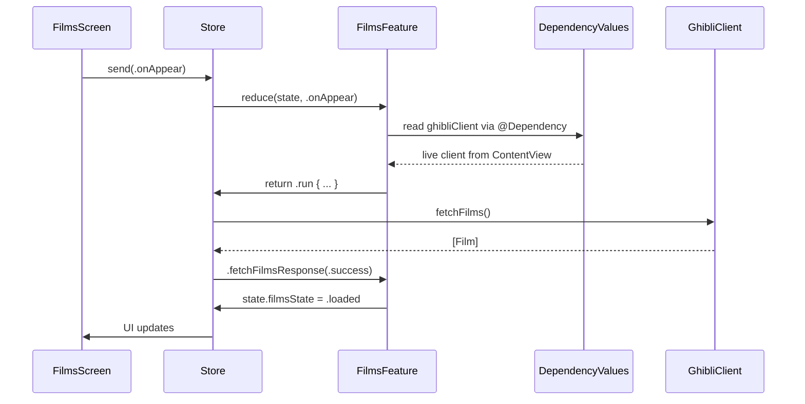

# TCA Dependency Injection in GhibliSwiftUIApp

This guide explains **how dependencies work in this app** using TCA's `@Dependency` system. No prior TCA DI experience required.

---

## What problem does this solve?

Features need to call the network and save favorites, but reducers should **not** know about `URLSession`, SwiftData, or `UserDefaults` directly.

We hide that behind small **client** structs (`GhibliClient`, `FavoritesClient`). The question is: **how does a reducer get the right client?**

**Before:** every reducer took clients in `init(ghibliClient:)` and parents passed them down — lots of boilerplate.

**Now (idiomatic TCA):** you register clients once on the `Store`, and any reducer reads them with `@Dependency(\.ghibliClient)`.

---

## Big picture (one diagram)



**Rule of thumb:**

1. **Build** real clients in `LiveDependencies` (repositories, cache, API).
2. **Register** them on the root `Store` with `withDependencies`.
3. **Read** them inside reducers with `@Dependency` — no `init` parameters.

---

## The four pieces (in order)

### 1. `@DependencyClient` — define the dependency type

File: `GhibliSwiftUIApp/Clients/GhibliClient.swift`

```swift
@DependencyClient
struct GhibliClient: Sendable {
    var fetchFilms: @Sendable () async throws -> [Film] = { [] }
    var searchFilms: @Sendable (_ searchTerm: String) async throws -> [Film] = { _ in [] }
    var fetchPeople: @Sendable (_ film: Film) async throws -> [Person] = { _ in [] }
}
```

- A **struct of closures**, not a class — easy to swap in tests.
- Default values (`= { [] }`) are required by the macro so TCA can build a safe placeholder.
- Same pattern for `FavoritesClient` (`loadFavoriteIDs`, `saveFavoriteIDs`).

### 2. `DependencyKey` — register a default value

```swift
extension GhibliClient: DependencyKey {
    static let liveValue = GhibliClient()  // placeholder; overridden at app launch
}
```

- `liveValue` is the fallback if nothing else is set.
- In this app, **real** values always come from `ContentView`'s `withDependencies` block.

### 3. `DependencyValues` — name used in `@Dependency(\.ghibliClient)`

```swift
extension DependencyValues {
    var ghibliClient: GhibliClient {
        get { self[GhibliClient.self] }
        set { self[GhibliClient.self] = newValue }
    }
}
```

This is what lets you write `@Dependency(\.ghibliClient)` instead of a longer key path.

### 4. `@Dependency` — read the client inside a reducer

File: `GhibliSwiftUIApp/Features/Films/FilmsFeature.swift`

```swift
struct FilmsFeature: Reducer {
    @Dependency(\.ghibliClient) var ghibliClient

    var body: some Reducer<State, Action> {
        Reduce { state, action in
            case .onAppear:
                return .run { send in
                    let films = try await ghibliClient.fetchFilms()
                    await send(.fetchFilmsResponse(.success(films)))
                }
        }
    }
}
```

- No `init(ghibliClient:)` on the reducer.
- Child reducers (`FilmDetailFeature`, `FilmTabNavigation`) also use `@Dependency` — they **inherit** the same values from the parent `Store`. You do **not** pass clients into `.forEach` or `.ifCaseLet`.

---

## Where live clients are built (`LiveDependencies`)

File: `GhibliSwiftUIApp/Clients/LiveDependencies.swift`

`LiveDependencies` is still the **only** place that connects clients to real infrastructure:

| Step | What gets wired |
|------|-----------------|
| Network | `DefaultGhibliService` or `MockGhibliService` |
| Remote repo | `DefaultGhibliRepository` |
| Cache | `OfflineFirstGhibliRepository` + SwiftData |
| Favorites | `DefaultFavoritesRepository` + `UserDefaults` |

It returns ready-to-use clients:

```swift
let (ghibliClient, favoritesClient) = LiveDependencies.make(cacheContainer: cacheContainer)
// ghibliClient.fetchFilms → repository → cache/API
// favoritesClient.loadFavoriteIDs → UserDefaults
```

**Important:** `LiveDependencies` builds clients. **`withDependencies`** puts them into TCA's global-for-this-store context. Both steps are needed.

---

## Composition root (`ContentView`)

File: `GhibliSwiftUIApp/App/ContentView.swift`

This is the **only** place production clients are registered for the running app:

```swift
store = Store(initialState: AppFeature.State()) {
    AppFeature()
} withDependencies: {
    let (ghibliClient, favoritesClient) = LiveDependencies.make(
        cacheContainer: cacheContainer,
        useMockService: useMockService
    )
    $0.ghibliClient = ghibliClient
    $0.favoritesClient = favoritesClient
}
```

- `$0` is `inout DependencyValues` — the bag of dependencies for this store.
- Every child store created by `Scope`, `.forEach(\.path)`, etc. sees the **same** bag.
- Previews use `LiveDependencies.makePreview()` the same way.

---

## Who uses which dependency?

| Reducer | Dependency | Used for |
|---------|------------|----------|
| `FilmsFeature` | `@Dependency(\.ghibliClient)` | Load film catalog |
| `FavoritesFeature` | `@Dependency(\.ghibliClient)` | Load catalog (filter favorites client-side) |
| `SearchFeature` | `@Dependency(\.ghibliClient)` | Search API |
| `SearchFeature` | `@Dependency(\.continuousClock)` | 500 ms debounce (TCA built-in) |
| `FilmDetailFeature` | `@Dependency(\.ghibliClient)` | Load characters for a film |
| `AppFeature` | `@Dependency(\.favoritesClient)` | Load/save favorite IDs |
| `SettingsFeature` | *(none)* | Uses `SettingsStorage` directly (UserDefaults helper) |
| `PersonDetailFeature` | *(none)* | Display-only; no API call |

`FilmTabNavigation` has **no** `@Dependency` properties — it only composes child reducers. Those children read `ghibliClient` themselves.

---

## How an effect uses a dependency (timeline)

Example: user opens the Movies tab.



You do **not** capture `[ghibliClient]` in `.run` anymore. The effect runs in the store's dependency context, so `ghibliClient` resolves correctly.

---

## Testing with mocks

File: `GhibliSwiftUIAppTests/Features/FilmsFeatureTests.swift`

Tests override dependencies the same way the app does — with `withDependencies` on `TestStore`:

```swift
let store = TestStore(initialState: FilmsFeature.State()) {
    FilmsFeature()
} withDependencies: {
    $0.ghibliClient = makeMockGhibliClient()
}
```

For search debounce tests:

```swift
} withDependencies: {
    $0.ghibliClient = makeMockGhibliClient()
    $0.continuousClock = ImmediateClock()  // no real 500 ms wait
}
```

Mock factories live in `GhibliSwiftUIAppTests/Mocks/MockClients.swift`. They return a `GhibliClient` / `FavoritesClient` with fake closures — no network, no disk.

---

## Old vs new (quick reference)

| Topic | Old (constructor injection) | New (`@Dependency`) |
|-------|----------------------------|---------------------|
| Root store | `AppFeature(ghibliClient:, favoritesClient:)` | `AppFeature()` + `withDependencies` |
| Tab feature | `FilmsFeature(ghibliClient:)` | `FilmsFeature()` + `@Dependency(\.ghibliClient)` |
| Navigation child | `FilmTabNavigation(ghibliClient:)` | `FilmTabNavigation()` |
| Effect | `.run { [ghibliClient] send in ... }` | `.run { send in ... ghibliClient ... }` |
| Test | Pass mock in reducer `init` | `withDependencies { $0.ghibliClient = mock }` |

---

## Mental model

Think of `DependencyValues` as a **backpack** attached to each `Store`:

- `ContentView` puts the real clients in the backpack at startup.
- Every reducer on that store tree can reach into the backpack with `@Dependency`.
- Tests put fake clients in the backpack before running `TestStore`.
- `LiveDependencies` is the factory that **builds** what goes in the backpack; it is not the backpack itself.

---

## Related files

| File | Role |
|------|------|
| `Clients/GhibliClient.swift` | API client + `DependencyKey` |
| `Clients/FavoritesClient.swift` | Favorites client + `DependencyKey` |
| `Clients/LiveDependencies.swift` | Build live/preview clients from repos |
| `App/ContentView.swift` | Register dependencies on root store |
| `Features/*/` | `@Dependency` on reducers that need clients |
| `Tests/Mocks/MockClients.swift` | Fake clients for tests |
| `Tests/Features/*Tests.swift` | `TestStore` + `withDependencies` |

For navigation (separate topic), see [FILMS_NAVIGATION_TCA_GUIDE.md](FILMS_NAVIGATION_TCA_GUIDE.md).
